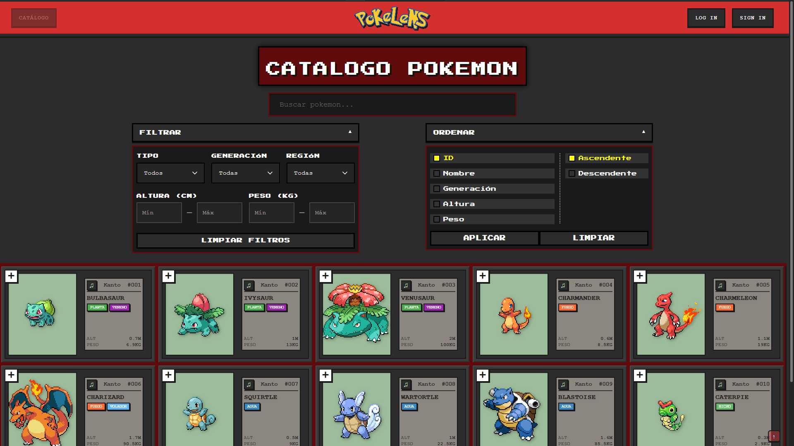
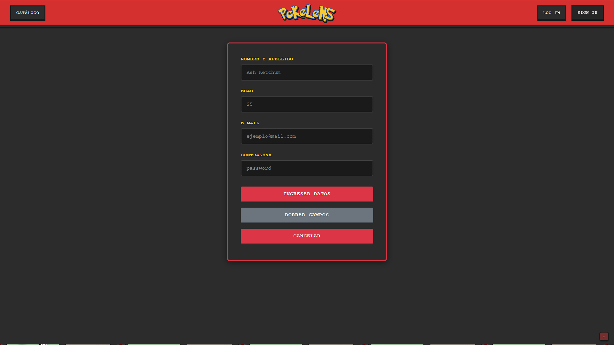
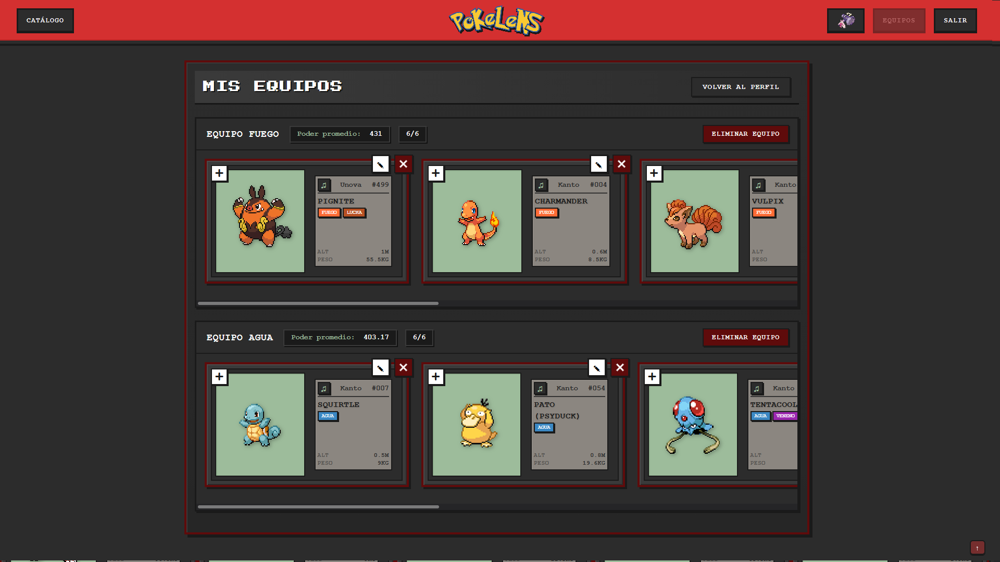
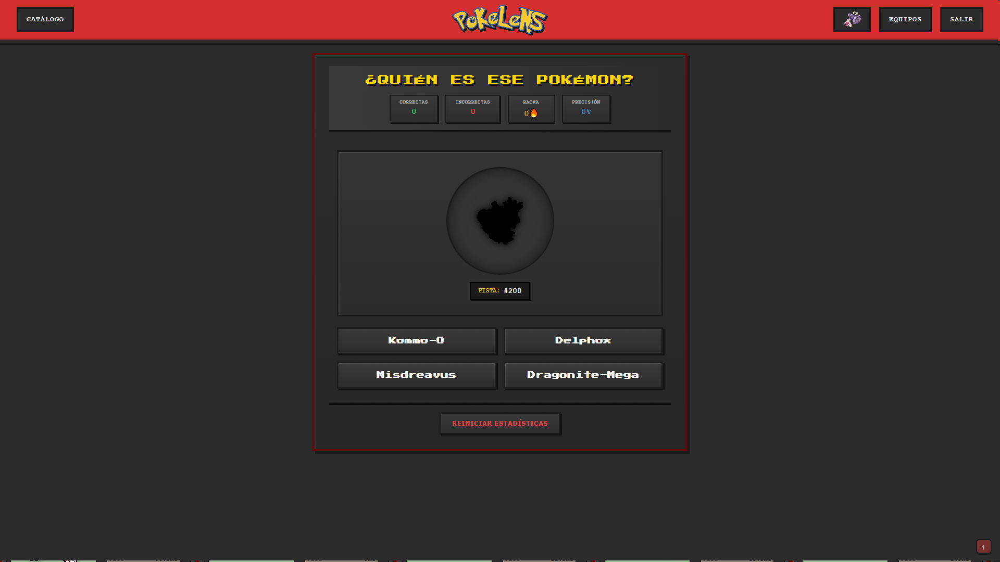
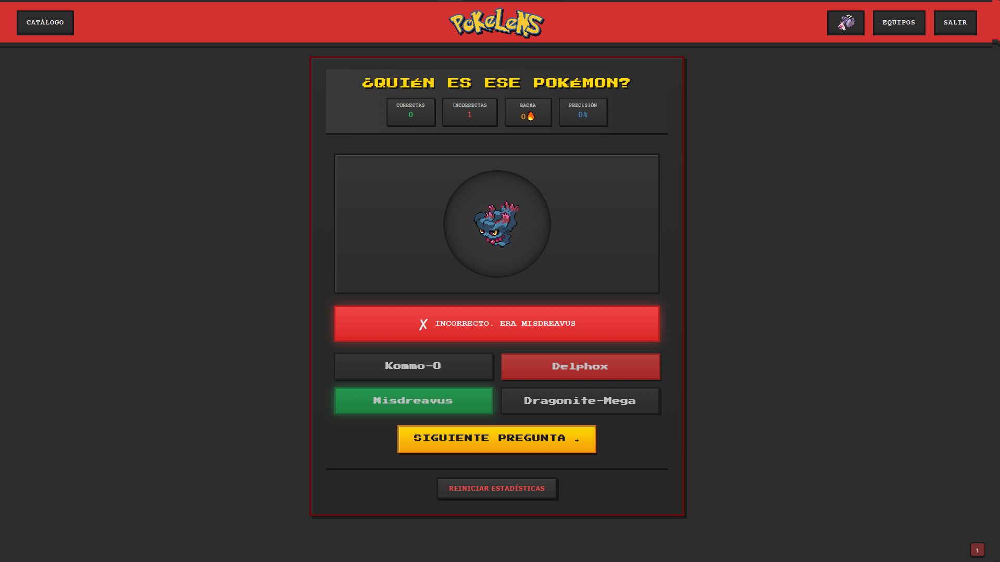

## Descripción

PokéLens es una aplicación web educativa y entretenida diseñada para explorar el universo Pokémon de manera simple e intuitiva. Dirigida a todo tipo de público, desde principiantes hasta fanáticos, permite descubrir criaturas Pokémon, crear colecciones personales, participar en quizzes y acumular puntos por actividades. Desarrollada como proyecto académico en la Universidad Tecnológica Nacional de Mar del Plata, utiliza tecnologías modernas para ofrecer una experiencia visual atractiva y accesible.

## Funcionalidades Principales

- **Exploración del Catálogo**: Navega por un listado dinámico de Pokémon obtenido de la PokeAPI. Busca por nombre o ID, filtra por tipo (agua, fuego, etc.) y visualiza detalles como sprite, tipos, altura, peso y estadísticas base. Incluye paginación con scroll infinito y un Pokémon del día destacado.
- 
- **Registro e Inicio de Sesión**: Crea una cuenta con email y contraseña para acceder a funciones personalizadas. Actualiza tu perfil (nombre visible) y cierra sesión de forma segura.
- 
- **Colección Personal**: Agrega hasta 6 Pokémon favoritos a tu equipo, evita duplicados y elimina elementos. Calcula el promedio de poder basado en estadísticas (HP, Attack, Defense, Sp.Atk, Sp.Def y Speed).
- 
- **Sistema de Puntos**: Acumula puntos por inicio de sesión diario, creación de colecciones semanales y aciertos en el quiz. Visualiza tus puntos en el perfil.
- **Quiz Pokémon**: Participa en una trivia adivinando el nombre de un Pokémon mostrado en sombra. Gana puntos por respuestas correctas.
- 
- 
- **Reproducir Sonidos**: Escucha el sonido característico de cada Pokémon en su detalle o tarjeta.
- **Interfaz Amigable**: Indicadores de carga, mensajes de error/confirmación, navegación fluida sin recargas y diseño responsive.

## Cómo Usar

1. **Acceso Inicial**: Visita la aplicación para explorar el catálogo sin registrarte.
2. **Registro**: Usa el formulario para crear una cuenta (email y contraseña válidos).
3. **Inicio de Sesión**: Ingresa tus credenciales para acceder a tu perfil y ganar puntos diarios.
4. **Búsqueda y Filtros**: En el catálogo, busca o filtra Pokémon, haz clic para ver detalles y reproduce su sonido.
5. **Gestión de Equipo**: Agrega/elimina Pokémon a tu colección, ve el promedio de poder y gana puntos por creaciones semanales.
6. **Quiz**: Accede al quiz, adivina el Pokémon en sombra y acumula puntos por aciertos.
7. **Perfil**: Visualiza y edita tu nombre, revisa puntos acumulados.
8. **Cerrar Sesión**: Sal de tu cuenta para mayor seguridad.

La app es responsiva, compatible con móviles y desktops, con tiempos de carga rápidos y diseño intuitivo.

## Requisitos

- Navegador web moderno (Chrome, Firefox, etc.).
- Conexión a internet para acceder a la PokeAPI.

## Instalación Local (Opcional)

Para ejecutar localmente:
1. Clona el repositorio: `git clone https://github.com/tomasEtchecopar/pokeLens`.
2. Instala dependencias: `npm install`.
3. Ejecuta JSON Server: `json-server --watch db.json`.
4. Inicia la app: `ng serve`.
5. Accede en `http://localhost:4200`.

## Enlaces

- [GitHub](https://github.com/tomasEtchecopar/pokeLens)
- [Jira](https://tomasetcecopar.atlassian.net/jira/software/projects/SCRUM/boards/1)

Desarrollado por: Tomás Etchecopar, Adrián González, Juan Sebastián Farías.  
